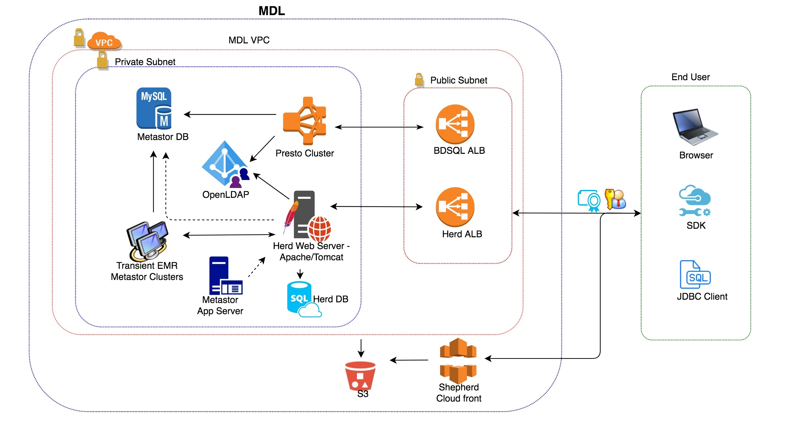
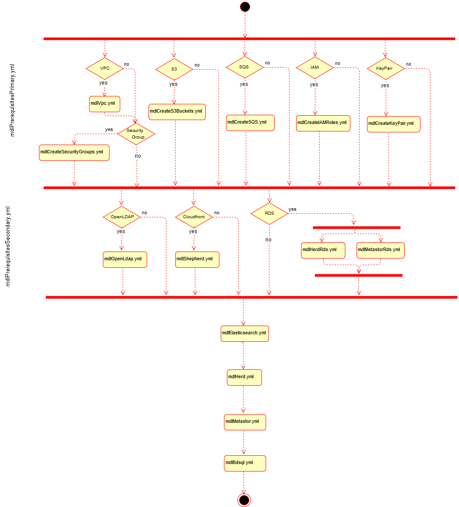

Herd-MDL Technical Overview
============

## Herd-MDL Architecture

MDL consists of four major components.

### Herd
*   Herd maintains the metadata information about each object registered/tracked by MDL. 
*   Herd ALB enables the end user to connect to Herd web server. Note that the MDL components are hosted in private subnets for security reasons, and the ALBs enable users to interact with each component.
*   Herd has a postgres database which stores all the metadata information
*   Herd uses OpenLDAP for authentication/authorization of end users
*   Herd can be deployed with SSL or without SSL support
*   End user can access Herd in three ways
    *   REST endpoints - Herd provides REST endpoints which can be used to interact with Herd
        *   User may use any of the rest clients available to them like [PostMan](https://chrome.google.com/webstore/detail/postman/fhbjgbiflinjbdggehcddcbncdddomop?hl=en) or [Advanced Rest Client](https://chrome.google.com/webstore/detail/advanced-rest-client/hgmloofddffdnphfgcellkdfbfbjeloo?hl=en-US)
    *   SDK - Herd provides a Java SDK in case user needs to interact with Herd through Java applications
    *   Command line - End user can use [cURL](https://curl.haxx.se) command to interact with Herd end points              

### Herd-UI

*   Herd UI provides the user interface for the end user to retrieve details about the objects tracked by Herd
*   Cloudfront is used to render the angular pages for UI
*   Herd-UI supports both SSL or Plaintext deployments

### Metastor

*   Metastor shares the Hive metastore with Bdsql Presto cluster
*   Metastor takes care of updating Hive metastore for the objects tracked in MDL
*   As soon as Hive metastore is updated, the objects are available in Bdsql Presto cluster for querying, as they share the same Hive metastore
*   Metastor creates Hive external tables pointing to the S3 location of data objects/partitions
*   Metastor uses notification feature (Activiti) from Herd for data upload event notifications

### Big Data SQL (BDSQL)

*   BDSQL uses EMR Presto cluster which is extended to user through JDBC end point
*   BDSQL takes care of authorization for the objects being queried through Presto
*   BDSQL uses OpenLDAP for authentication/authorization
*   BDSQL supports both SSL and Plaintext deployments

## Herd-MDL Product Install 

Herd-MDL makes extensive use of CloudFormation to create AWS resources and to install and configure the Herd-MDL product. Instructions are available to perform [Basic]() and [Advanced]() installations. The sections below include information to help understand the details of the product install. And feel free to browse the source code as well - start with the [top-level Herd-MDL CloudFormation install template](https://github.com/FINRAOS/herd-mdl/releases/download/mdl-v1.1.0/installMDL.yml) and dig!

### Flow Diagram

This section describes the nested CloudFormation templates and flow between. The layers of the flow are as follows:

*   MDL - Installation template
    *    Wrapper template that takes in various general and specific parameters
    *    Calls prerequisite stacks conditionally depending on parameters
    *    Calls MDL stacks
*   MDL - Prerequisites primary installation templates
    *    Conditionally creates required AWS resources based on general parameters
    *    MDL can create all required AWS resources -- or for 'Advanced' installations, it can refer to externally created AWS resources 
    *    Nothing specific to MDL product is configured in this layer - just AWS resources that are *NOT* EC2, RDS, ALB, EMR
*   MDL - Prerequisites secondary installation templates   
    *    Creates required MDL resources: RDS for Herd, Metastore
    *    Creates Herd-UI static asset deployment
*   MDL - Product installation templates
    *    ElasticSearch - install and configure ElasticSearch for use by Herd
    *    Herd Webserver - install Herd and create endpoint for REST APIs
    *    Metastor Server - install Metastore, integrate with Herd
    *    Bdsql - install BDSQL, integrate with Metastore, create JDBC endpoint

### Resources Diagram

This diagram shows all the resources created during Herd-MDL Product Install:

